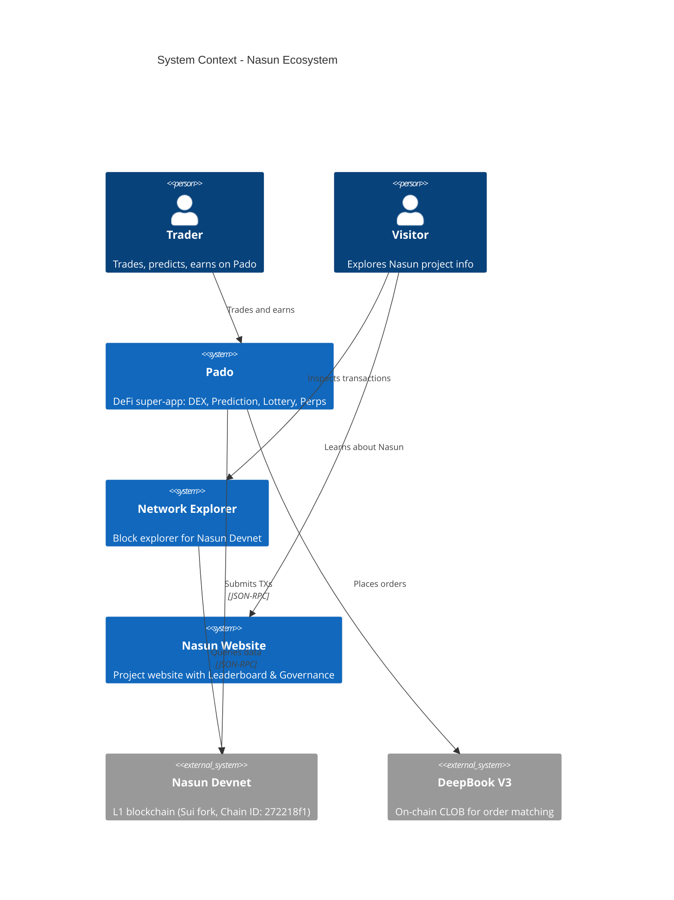
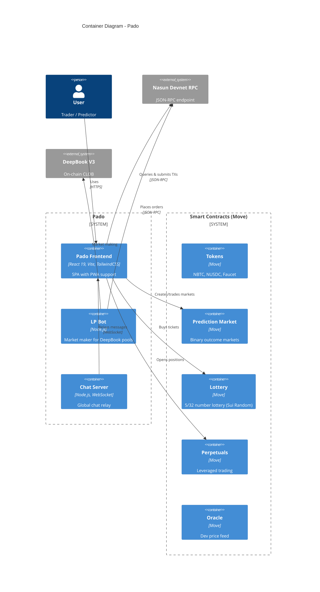

# C4 Architecture Diagrams

C4 모델을 사용하여 Mermaid 문법으로 소프트웨어 아키텍처를 문서화합니다.

## C4 레벨 가이드

| Level | 다이어그램 | 대상 | 표시 내용 | 생성 시점 |
| ----- | ---------- | ---- | --------- | --------- |
| 1 | C4Context | 전체 | 시스템 + 외부 액터 | 항상 (필수) |
| 2 | C4Container | 기술팀 | 앱, DB, 서비스 | 항상 (필수) |
| 3 | C4Component | 개발자 | 내부 컴포넌트 | 가치가 있을 때만 |
| 4 | C4Deployment | DevOps | 인프라 노드 | 프로덕션 시스템 |
| - | C4Dynamic | 기술팀 | 요청 흐름 (번호) | 복잡한 워크플로 |

**핵심**: Context + Container만으로 대부분의 팀에 충분합니다.

## 워크플로

### Step 1: 스코프 결정

사용자에게 확인:
- 어떤 시스템/앱의 아키텍처인가?
- 대상 독자는 누구인가? (경영진, 개발자, DevOps)
- 어떤 레벨이 필요한가?

### Step 2: 코드베이스 분석

Explore 에이전트로 시스템 구조를 파악:
- 앱과 패키지 간 의존성
- 외부 시스템과의 연결
- 데이터 흐름

### Step 3: 다이어그램 생성

Mermaid C4 문법으로 다이어그램을 작성합니다.

### Step 4: 문서화

`docs/architecture/`에 마크다운 파일로 저장합니다.

## Mermaid C4 문법 레퍼런스

### People & Systems

```
Person(alias, "Label", "Description")
Person_Ext(alias, "Label", "Description")
System(alias, "Label", "Description")
System_Ext(alias, "Label", "Description")
SystemDb(alias, "Label", "Description")
SystemQueue(alias, "Label", "Description")
```

### Containers

```
Container(alias, "Label", "Technology", "Description")
Container_Ext(alias, "Label", "Technology", "Description")
ContainerDb(alias, "Label", "Technology", "Description")
ContainerQueue(alias, "Label", "Technology", "Description")
```

### Components

```
Component(alias, "Label", "Technology", "Description")
ComponentDb(alias, "Label", "Technology", "Description")
```

### Boundaries

```
Enterprise_Boundary(alias, "Label") { ... }
System_Boundary(alias, "Label") { ... }
Container_Boundary(alias, "Label") { ... }
```

### Relationships

```
Rel(from, to, "Label")
Rel(from, to, "Label", "Technology")
BiRel(from, to, "Label")
Rel_U / Rel_D / Rel_L / Rel_R  # 방향 지정
```

### Deployment Nodes

```
Deployment_Node(alias, "Label", "Type") { ... }
```

### Layout & Styling

```
UpdateLayoutConfig($c4ShapeInRow="3", $c4BoundaryInRow="1")
UpdateElementStyle(alias, $bgColor="grey", $fontColor="white")
UpdateRelStyle(from, to, $textColor="blue", $offsetY="-10")
```

## Nasun 아키텍처 프리셋

### System Context (Level 1)



### Container Diagram (Level 2)



## Best Practices

1. **모든 요소에 필수**: 이름, 타입, 기술(해당 시), 설명
2. **단방향 화살표만 사용**: 양방향은 모호함 유발
3. **행위 동사로 레이블**: "Sends email using", "Reads from"
4. **기술 레이블 포함**: "JSON/HTTPS", "WebSocket", "Move"
5. **다이어그램당 20개 이하 요소**: 복잡하면 분리
6. **항상 제목 포함**: "Container Diagram for [System]"

## 출력 위치

`docs/architecture/` 디렉토리에 저장:
- `c4-context.md` — System Context
- `c4-containers.md` — Container 다이어그램
- `c4-components-{feature}.md` — Component (feature별)
- `c4-deployment.md` — Deployment
- `c4-dynamic-{flow}.md` — Dynamic (flow별)
