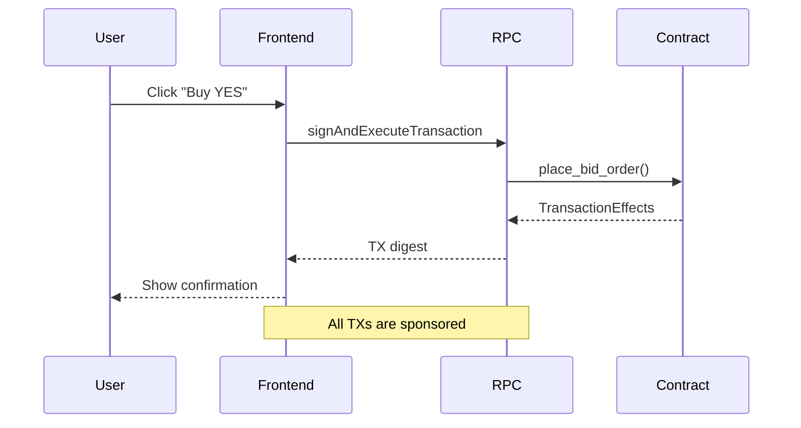
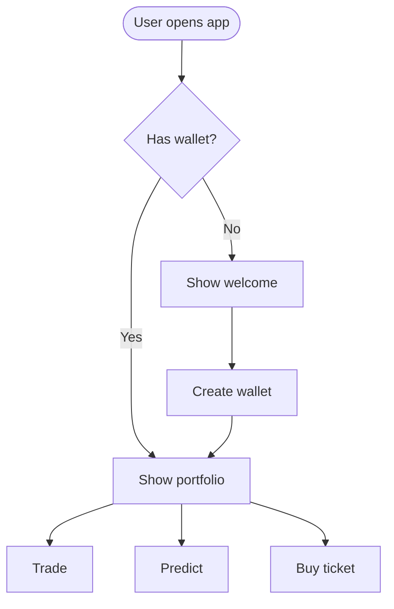
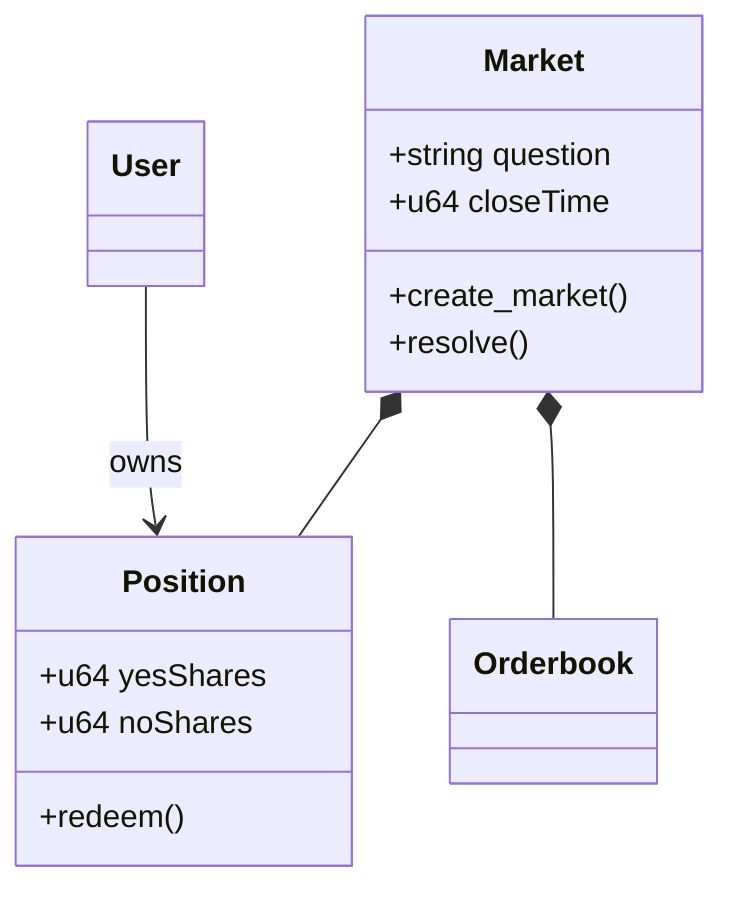
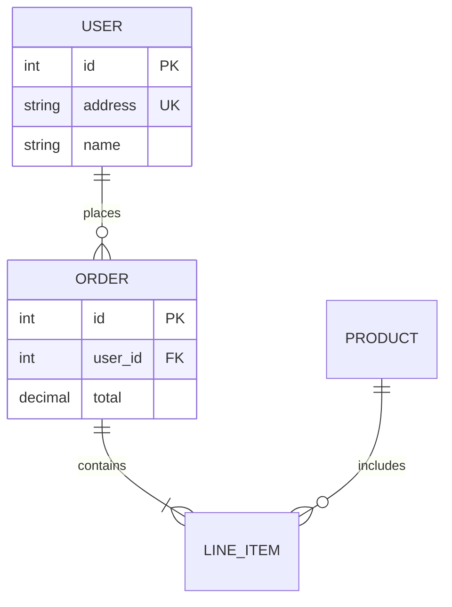
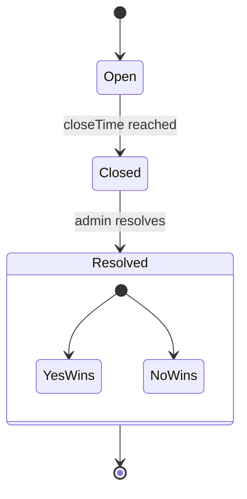

# Mermaid Diagrams

Mermaid 텍스트 기반 문법으로 소프트웨어 다이어그램을 생성합니다.
GitHub/GitLab에서 자동 렌더링되며, 코드와 함께 버전 관리됩니다.

## 다이어그램 타입 선택

| 타입 | 용도 | 키워드 |
| ---- | ---- | ------ |
| Sequence | API 흐름, 인증, 컴포넌트 상호작용 | `sequenceDiagram` |
| Flowchart | 프로세스, 알고리즘, 의사결정 | `flowchart TD/LR` |
| Class | 도메인 모델, OOP 설계 | `classDiagram` |
| ERD | 데이터베이스 스키마, 테이블 관계 | `erDiagram` |
| State | 상태 머신, 라이프사이클 | `stateDiagram-v2` |
| Gantt | 프로젝트 타임라인 | `gantt` |
| Git Graph | 브랜칭 전략 | `gitGraph` |
| Pie | 데이터 시각화 | `pie` |

**C4 아키텍처 다이어그램은 `/c4` 스킬 사용**

## Quick Reference

### Sequence Diagram

**화살표 문법**:
- `->>` 실선, 동기 요청
- `-->>` 점선, 응답
- `-x` 실패
- `-)` 비동기

**블록**:
- `alt/else/end` — 조건 분기
- `opt/end` — 선택적
- `loop/end` — 반복
- `par/and/end` — 병렬
- `Note over A,B: text` — 노트

### Flowchart

**노드 모양**:
- `[text]` 사각형
- `(text)` 둥근 사각형
- `{text}` 다이아몬드 (조건)
- `([text])` 스타디움 (시작/끝)
- `[[text]]` 서브루틴
- `[(text)]` 실린더 (DB)

**방향**: `TD` 위→아래, `LR` 왼→오른쪽, `BT` 아래→위, `RL` 오른→왼쪽

### Class Diagram

**관계**:
- `<|--` 상속
- `*--` 컴포지션 (포함)
- `o--` 집합 (참조)
- `-->` 연관
- `..>` 의존

### ERD

**카디널리티**:
- `||--||` 1:1
- `||--o{` 1:N
- `}o--o{` N:M

### State Diagram

## Best Practices

1. **단순하게 시작** — 핵심 요소부터, 점진적으로 상세화
2. **의미 있는 이름** — 명확한 레이블이 자가 문서화
3. **한 다이어그램 = 한 개념** — 복잡하면 여러 다이어그램으로 분리
4. **제목 포함** — `title` 또는 첫 번째 노트로 목적 설명
5. **코드와 함께 저장** — `.md` 파일에 인라인으로 포함

## 렌더링 환경

- **GitHub/GitLab**: 마크다운에서 자동 렌더링
- **VS Code**: Markdown Mermaid 확장
- **Notion/Obsidian**: 내장 지원
- **CLI**: `npx @mermaid-js/mermaid-cli -i input.mmd -o output.png`
